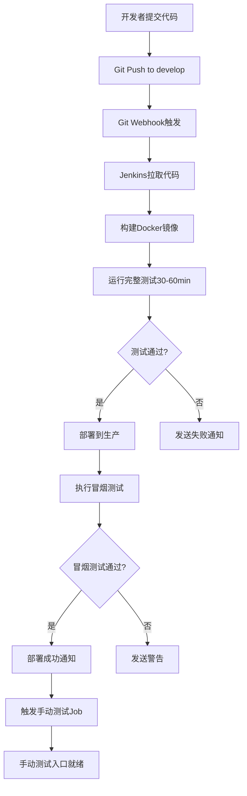

# Jenkins CI/CD 流水线使用手册

> 电商智能客服 SaaS 平台 - 自动化部署完整指南

## 📋 目录

- [1. 概述](#1-概述)
- [2. 环境准备](#2-环境准备)
- [3. Jenkins配置](#3-jenkins配置)
- [4. Git Webhook配置](#4-git-webhook配置)
- [5. 使用流程](#5-使用流程)
- [6. 手动测试入口](#6-手动测试入口)
- [7. 故障排查](#7-故障排查)
- [8. 日常维护](#8-日常维护)
- [9. 常见问题](#9-常见问题)

---

## 1. 概述

### 1.1 流水线架构



### 1.2 核心特性

- ✅ **自动触发**: develop分支推送自动触发
- ✅ **完整测试**: 30-60分钟全覆盖测试
- ✅ **零停机部署**: Docker滚动更新
- ✅ **自动冒烟测试**: 部署后健康验证
- ✅ **手动测试入口**: 3种方式触发测试
- ✅ **通知机制**: 企业微信/钉钉通知

---

## 2. 环境准备

### 2.1 服务器环境

```bash
# 服务器信息
Jenkins服务器: 115.190.75.88:8080
部署目标: 同一服务器 (本机部署)
应用端口: 8000
```

### 2.2 执行初始化脚本

在Jenkins服务器上执行:

```bash
# 1. 进入项目目录
cd /path/to/ecom-chat-bot

# 2. 运行初始化脚本
sudo bash scripts/init-deployment.sh
```

初始化脚本会完成:
- ✅ 创建部署目录 `/opt/ecom-chat-bot`
- ✅ 生成生产环境配置 `.env.production`
- ✅ 创建Docker网络
- ✅ 配置日志轮转
- ✅ 设置权限

### 2.3 修改生产环境配置

```bash
# 编辑配置文件
sudo vi /opt/ecom-chat-bot/shared/.env.production
```

**重要配置项**:
```bash
# JWT密钥（已自动生成，建议保留）
JWT_SECRET=<自动生成的随机值>

# LLM API Key（根据实际使用的服务商修改）
DEEPSEEK_API_KEY=your_actual_api_key

# CORS配置（添加实际的前端域名）
CORS_ORIGINS=["http://your-frontend.com"]
```

### 2.4 启动基础服务

```bash
# 确保基础服务运行中
cd /path/to/ecom-chat-bot
docker-compose up -d postgres redis milvus rabbitmq

# 检查服务状态
docker-compose ps

# 查看服务健康状态
docker ps --filter "name=ecom-chatbot" --format "table {{.Names}}\t{{.Status}}"
```

---

## 3. Jenkins配置

### 3.1 安装必要插件

登录Jenkins (http://115.190.75.88:8080)，确认以下插件已安装:

```
Manage Jenkins > Plugins > Installed Plugins

必需插件:
☑ Git Plugin
☑ Pipeline Plugin
☑ Docker Pipeline Plugin
☑ Generic Webhook Trigger Plugin
☑ HTML Publisher Plugin
☑ JUnit Plugin

可选插件:
☐ Email Extension Plugin (邮件通知)
☐ DingTalk Plugin (钉钉通知)
```

### 3.2 创建主流水线Job

#### 步骤 1: 创建Pipeline Job

```
1. 点击 "新建Item"
2. 输入名称: ecom-chatbot-cicd-pipeline
3. 选择类型: Pipeline
4. 点击 "OK"
```

#### 步骤 2: 配置Job

**General 配置**:
```
☑ GitHub project (可选)
  Project url: https://gitee.com/your-repo/ecom-chat-bot

☑ 参数化构建过程 (可选，使用Pipeline参数)

描述:
  电商智能客服 SaaS 平台 - CI/CD 自动部署流水线
  自动触发: develop 分支推送
```

**Build Triggers**:
```
☑ Generic Webhook Trigger
  Token: ecom-chatbot-deploy-token
  
  Variables:
    - Variable: ref
      Expression: $.ref
    - Variable: repository  
      Expression: $.repository.name
      
  Optional filter:
    Expression: refs/heads/develop
    Text: $ref
```

**Pipeline 配置**:
```
Definition: Pipeline script from SCM

SCM: Git
  Repository URL: https://gitee.com/your-repo/ecom-chat-bot.git
  Credentials: (选择Git凭证，如需要)
  
  Branches to build:
    Branch Specifier: */develop

Script Path: Jenkinsfile

☑ Lightweight checkout
```

#### 步骤 3: 保存并测试

```bash
# 点击 "Save"

# 手动触发第一次构建测试
点击 "Build Now"

# 查看控制台输出
点击构建号 > "Console Output"
```

### 3.3 创建手动测试Job

#### 步骤 1: 创建Pipeline Job

```
1. 点击 "新建Item"
2. 输入名称: ecom-chatbot-manual-test
3. 选择类型: Pipeline
4. 点击 "OK"
```

#### 步骤 2: 配置Job

**General 配置**:
```
描述:
  手动测试Job - 用于部署后手动触发测试

☑ This project is parameterized
  (Pipeline中已定义参数，无需手动添加)
```

**Pipeline 配置**:
```
Definition: Pipeline script from SCM

SCM: Git
  Repository URL: https://gitee.com/your-repo/ecom-chat-bot.git
  Branches: */develop

Script Path: Jenkinsfile.manual-test

☑ Lightweight checkout
```

#### 步骤 3: 保存

```
点击 "Save"
```

### 3.4 配置凭证 (可选 - 用于通知)

```
Manage Jenkins > Credentials > System > Global credentials

添加企业微信Webhook:
  Kind: Secret text
  Secret: https://qyapi.weixin.qq.com/cgi-bin/webhook/send?key=YOUR_KEY
  ID: wecom-webhook
  Description: 企业微信通知Webhook

添加钉钉Webhook:
  Kind: Secret text
  Secret: https://oapi.dingtalk.com/robot/send?access_token=YOUR_TOKEN
  ID: dingtalk-webhook
  Description: 钉钉通知Webhook
```

---

## 4. Git Webhook配置

### 4.1 Gitee Webhook配置

```
1. 进入Gitee仓库设置
2. 管理 > WebHooks > 添加WebHook

配置项:
  URL: http://115.190.75.88:8080/generic-webhook-trigger/invoke?token=ecom-chatbot-deploy-token
  
  密码 (Secret): (留空或设置密码)
  
  触发事件: ☑ Push
  
  分支过滤: develop
  
  SSL验证: ☐ (如Jenkins未配置SSL)

3. 点击 "添加"
4. 点击 "测试" 验证连接
```

### 4.2 GitHub Webhook配置

```
1. 进入GitHub仓库设置
2. Settings > Webhooks > Add webhook

配置项:
  Payload URL: http://115.190.75.88:8080/generic-webhook-trigger/invoke?token=ecom-chatbot-deploy-token
  
  Content type: application/json
  
  Secret: (留空)
  
  Which events: ☑ Just the push event
  
  ☑ Active

3. Add webhook
4. 查看 "Recent Deliveries" 验证
```

### 4.3 测试Webhook

```bash
# 手动触发Webhook测试
curl -X POST \
  "http://115.190.75.88:8080/generic-webhook-trigger/invoke?token=ecom-chatbot-deploy-token" \
  -H "Content-Type: application/json" \
  -d '{
    "ref": "refs/heads/develop",
    "repository": {"name": "ecom-chat-bot"}
  }'

# 查看Jenkins是否触发构建
# Jenkins > ecom-chatbot-cicd-pipeline > 查看构建历史
```

---

## 5. 使用流程

### 5.1 自动部署流程

```bash
# 1. 开发者推送代码
git add .
git commit -m "feat: add new feature"
git push origin develop

# 2. Jenkins自动触发 (约2-5秒延迟)
# 在Jenkins首页可以看到新的构建开始

# 3. 流水线执行 (约40-70分钟)
#    ├─ 代码检出 (1分钟)
#    ├─ 环境检查 (30秒)
#    ├─ 构建镜像 (3-5分钟)
#    ├─ 运行测试 (30-60分钟) ← 最耗时
#    ├─ 测试分析 (30秒)
#    ├─ 部署服务 (2-3分钟)
#    ├─ 冒烟测试 (1分钟)
#    └─ 触发手动测试 (即时)

# 4. 接收通知 (如已配置)
#    企业微信/钉钉/邮件通知

# 5. 验证部署
curl http://115.190.75.88:8000/health
```

### 5.2 查看构建状态

```
方式1: Jenkins Web界面
  http://115.190.75.88:8080/job/ecom-chatbot-cicd-pipeline/

方式2: 查看最新构建日志
  点击构建号 > Console Output

方式3: Blue Ocean界面 (更美观)
  http://115.190.75.88:8080/blue/
```

### 5.3 流水线状态说明

| 状态 | 图标 | 说明 |
|------|------|------|
| Success | ✅ | 所有阶段成功完成 |
| Unstable | ⚠️ | 测试有失败，但已部署 |
| Failure | ❌ | 构建失败，未部署 |
| Aborted | ⊗ | 手动终止 |
| In Progress | ⏳ | 正在执行 |

---

## 6. 手动测试入口

部署完成后，有3种方式执行手动测试:

### 6.1 方式1: Jenkins Job按钮 (推荐)

```
1. 打开Jenkins: http://115.190.75.88:8080
2. 找到 "ecom-chatbot-manual-test" Job
3. 点击 "Build with Parameters"
4. 选择参数:
   - BUILD_NUMBER: latest (或指定版本号)
   - TEST_URL: http://115.190.75.88:8000
   - TEST_SUITE: 选择测试套件
     * quick - 快速测试 (10-15分钟)
     * full - 完整测试 (30-60分钟)
     * api - API测试
     * integration - 集成测试
     * smoke - 冒烟测试
   - CLEANUP_DATA: true (测试后清理数据)
5. 点击 "Build"
6. 查看测试报告
```

### 6.2 方式2: API触发

```bash
# 触发快速测试
curl -X POST \
  "http://115.190.75.88:8080/job/ecom-chatbot-manual-test/buildWithParameters?token=test-token&TEST_SUITE=quick"

# 触发完整测试
curl -X POST \
  "http://115.190.75.88:8080/job/ecom-chatbot-manual-test/buildWithParameters?token=test-token&TEST_SUITE=full&BUILD_NUMBER=latest"
```

### 6.3 方式3: 直接执行测试脚本

```bash
# SSH到服务器
ssh user@115.190.75.88

# 快速冒烟测试
bash /opt/ecom-chat-bot/smoke-test.sh http://localhost:8000

# 完整测试（使用Docker）
docker run --rm --network host \
  -e TEST_BASE_URL=http://localhost:8000 \
  ecom-chat-bot-test:latest \
  pytest --html=reports/test.html
```

### 6.4 查看测试报告

```
方式1: Jenkins Web界面
  Job页面 > 构建号 > Test Results
  Job页面 > 构建号 > 手动测试报告-{suite}

方式2: 下载测试报告
  Job页面 > 构建号 > Build Artifacts
  下载 reports.zip

方式3: 查看覆盖率报告 (full测试)
  Job页面 > 构建号 > 覆盖率报告
```

---

## 7. 故障排查

### 7.1 构建失败排查

#### 问题1: 代码检出失败

```
错误信息: Failed to connect to repository

解决方案:
1. 检查Git凭证是否正确
   Manage Jenkins > Credentials

2. 测试Git连接
   在Job配置页面点击 "Test Connection"

3. 检查网络连接
   ssh jenkins@115.190.75.88
   git clone <your-repo-url>
```

#### 问题2: Docker镜像构建失败

```
错误信息: Error response from daemon

解决方案:
1. 检查Dockerfile语法
   docker build -f backend/Dockerfile backend/

2. 检查磁盘空间
   df -h
   docker system df

3. 清理Docker缓存
   docker system prune -a

4. 查看Docker日志
   sudo journalctl -u docker -n 100
```

#### 问题3: 测试超时

```
错误信息: Timeout after 120 minutes

解决方案:
1. 调整超时时间
   在Jenkinsfile中修改:
   options {
       timeout(time: 180, unit: 'MINUTES')
   }

2. 使用快速测试 (临时)
   Build with Parameters > SKIP_TESTS: true

3. 优化测试性能
   减少并发测试数
   增加测试超时阈值
```

#### 问题4: 部署失败

```
错误信息: Deployment failed

解决方案:
1. 检查部署脚本权限
   ls -la /opt/ecom-chat-bot/jenkins-deploy.sh
   chmod +x /opt/ecom-chat-bot/jenkins-deploy.sh

2. 检查Docker服务
   docker ps
   docker-compose ps

3. 查看部署日志
   docker logs ecom-chatbot-api

4. 手动执行部署
   sudo bash /opt/ecom-chat-bot/jenkins-deploy.sh <BUILD_NUMBER>
```

### 7.2 服务异常排查

#### 服务无法访问

```bash
# 1. 检查容器状态
docker ps --filter "name=ecom-chatbot"

# 2. 检查容器日志
docker logs -f ecom-chatbot-api --tail 100

# 3. 检查端口占用
sudo lsof -i :8000

# 4. 检查健康状态
curl http://localhost:8000/health

# 5. 进入容器调试
docker exec -it ecom-chatbot-api bash
```

#### 数据库连接失败

```bash
# 1. 检查PostgreSQL状态
docker ps | grep postgres

# 2. 测试数据库连接
docker exec -it ecom-chatbot-postgres psql -U ecom_user -d ecom_chatbot -c "SELECT 1;"

# 3. 检查网络连接
docker network inspect ecom-network

# 4. 查看数据库日志
docker logs ecom-chatbot-postgres --tail 50
```

#### Redis连接失败

```bash
# 1. 检查Redis状态
docker ps | grep redis

# 2. 测试Redis连接
docker exec -it ecom-chatbot-redis redis-cli ping

# 3. 查看Redis日志
docker logs ecom-chatbot-redis --tail 50
```

### 7.3 性能问题排查

#### 响应慢

```bash
# 1. 检查容器资源使用
docker stats ecom-chatbot-api

# 2. 检查系统资源
top
htop

# 3. 检查磁盘IO
iostat -x 1

# 4. 查看慢查询日志
docker logs ecom-chatbot-api | grep "slow"
```

#### 内存溢出

```bash
# 1. 检查内存使用
docker stats --no-stream

# 2. 增加容器内存限制
# 在 docker-compose.prod.yml 中添加:
services:
  api:
    mem_limit: 2g
    mem_reservation: 1g

# 3. 重启容器
docker-compose -f /opt/ecom-chat-bot/docker-compose.prod.yml restart api
```

---

## 8. 日常维护

### 8.1 查看服务状态

```bash
# 方式1: Docker命令
docker ps --filter "name=ecom-chatbot" --format "table {{.Names}}\t{{.Status}}\t{{.Ports}}"

# 方式2: 使用项目脚本
bash scripts/status.sh

# 方式3: 健康检查
curl http://115.190.75.88:8000/health | python3 -m json.tool
```

### 8.2 查看日志

```bash
# 查看API服务日志
docker logs -f ecom-chatbot-api --tail 100

# 查看Celery日志
docker logs -f ecom-chatbot-celery --tail 100

# 查看所有服务日志
docker-compose -f /opt/ecom-chat-bot/docker-compose.prod.yml logs -f

# 查看特定时间段日志
docker logs ecom-chatbot-api --since 2024-02-12T10:00:00

# 导出日志
docker logs ecom-chatbot-api > /tmp/api-$(date +%Y%m%d).log
```

### 8.3 重启服务

```bash
# 重启API服务
docker restart ecom-chatbot-api

# 重启Celery服务
docker restart ecom-chatbot-celery

# 重启所有应用服务
cd /opt/ecom-chat-bot
docker-compose -f docker-compose.prod.yml restart

# 优雅重启（等待现有请求完成）
docker kill -s TERM ecom-chatbot-api
sleep 10
docker start ecom-chatbot-api
```

### 8.4 清理维护

```bash
# 清理旧镜像（保留最近5个）
docker images ecom-chat-bot-api --format "{{.Tag}}" | \
  grep -E '^[0-9]+$' | \
  sort -rn | \
  tail -n +6 | \
  xargs -r -I {} docker rmi ecom-chat-bot-api:{}

# 清理悬空镜像
docker image prune -f

# 清理未使用的容器
docker container prune -f

# 清理所有未使用资源
docker system prune -a --volumes

# 查看Docker占用空间
docker system df
```

### 8.5 备份恢复

#### 数据库备份

```bash
# 手动备份
docker exec ecom-chatbot-postgres pg_dump -U ecom_user ecom_chatbot > backup-$(date +%Y%m%d).sql

# 定时备份 (crontab)
0 2 * * * docker exec ecom-chatbot-postgres pg_dump -U ecom_user ecom_chatbot > /backup/ecom-chatbot-$(date +\%Y\%m\%d).sql

# 清理旧备份（保留7天）
find /backup -name "ecom-chatbot-*.sql" -mtime +7 -delete
```

#### 数据库恢复

```bash
# 从备份恢复
docker exec -i ecom-chatbot-postgres psql -U ecom_user ecom_chatbot < backup-20240212.sql

# 或使用pg_restore
docker exec -i ecom-chatbot-postgres pg_restore -U ecom_user -d ecom_chatbot -c < backup.dump
```

### 8.6 监控告警

#### 配置健康检查监控

```bash
# 创建监控脚本
cat > /opt/ecom-chat-bot/health-check.sh <<'EOF'
#!/bin/bash
if ! curl -sf http://localhost:8000/health > /dev/null; then
    echo "Service is down!" | mail -s "Alert: Service Down" ops@company.com
fi
EOF

chmod +x /opt/ecom-chat-bot/health-check.sh

# 添加到crontab（每5分钟检查）
*/5 * * * * /opt/ecom-chat-bot/health-check.sh
```

#### Jenkins监控Job

```groovy
// 创建新的Pipeline Job: health-monitor
pipeline {
    agent any
    triggers {
        cron('H/5 * * * *')  // 每5分钟
    }
    stages {
        stage('Health Check') {
            steps {
                sh '''
                    if ! curl -sf http://localhost:8000/health; then
                        echo "Service unhealthy!"
                        exit 1
                    fi
                '''
            }
        }
    }
    post {
        failure {
            // 发送告警通知
            echo "Health check failed!"
        }
    }
}
```

---

## 9. 常见问题

### Q1: 如何回滚到上一个版本？

```bash
# 方式1: 使用备份镜像
docker stop ecom-chatbot-api ecom-chatbot-celery
docker tag ecom-chat-bot-api:rollback ecom-chat-bot-api:latest
cd /opt/ecom-chat-bot
BUILD_NUMBER=rollback docker-compose -f docker-compose.prod.yml up -d

# 方式2: 使用历史版本号
# 查看可用版本
docker images ecom-chat-bot-api

# 指定版本启动
BUILD_NUMBER=123 docker-compose -f /opt/ecom-chat-bot/docker-compose.prod.yml up -d
```

### Q2: 如何跳过测试紧急发布？

```
方式1: Web界面
  Job页面 > Build with Parameters
  勾选 SKIP_TESTS: true
  点击 Build

方式2: 修改代码临时跳过
  在commit message中添加: [skip ci]
```

### Q3: 如何查看某次构建的详细信息？

```
1. 进入Job页面
2. 点击构建号 (#123)
3. 查看:
   - Console Output: 完整日志
   - Test Results: 测试结果
   - 测试报告: HTML报告
   - Pipeline Steps: 各阶段耗时
   - Build Artifacts: 构建产物
```

### Q4: 如何修改流水线配置？

```
方式1: 修改Jenkinsfile (推荐)
  1. 在项目中修改 Jenkinsfile
  2. 提交到Git
  3. Jenkins自动使用新配置

方式2: Job配置页面
  1. Job页面 > Configure
  2. 修改配置
  3. Save
```

### Q5: 如何配置邮件/钉钉通知？

参考Jenkinsfile中的 `sendNotification()` 函数，取消注释相关代码:

```groovy
// 企业微信通知
if (env.WECOM_WEBHOOK) {
    sh """
        curl -X POST ${env.WECOM_WEBHOOK} ...
    """
}
```

然后在Jenkins配置credentials:
```
Manage Jenkins > Credentials > Add
  Kind: Secret text
  Secret: <webhook-url>
  ID: wecom-webhook
```

### Q6: 测试一直失败怎么办？

```bash
# 1. 本地运行测试确认问题
cd backend/tests
pytest -v

# 2. 查看详细测试日志
Jenkins > Job > Build > Test Results > 点击失败的测试

# 3. 临时降低通过率阈值
在Jenkinsfile中修改:
if (passRate < 15) {  // 从15降低到10
    error "测试通过率过低"
}

# 4. 跳过测试紧急修复
Build with Parameters > SKIP_TESTS: true
```

### Q7: 如何添加新的测试？

```bash
# 1. 在项目中添加测试文件
backend/tests/api/test_new_feature.py

# 2. 提交到Git
git add backend/tests/api/test_new_feature.py
git commit -m "test: add new feature tests"
git push

# 3. Jenkins自动运行新测试
# 无需修改Pipeline配置
```

### Q8: 如何查看资源使用情况？

```bash
# 容器资源
docker stats ecom-chatbot-api ecom-chatbot-celery

# 系统资源
htop
free -h
df -h

# Docker占用
docker system df -v

# 网络流量
iftop
nethogs
```

---

## 附录

### A. 文件清单

```
项目文件:
  ├── Jenkinsfile                      # 主CI/CD流水线
  ├── Jenkinsfile.manual-test          # 手动测试Job
  ├── docker-compose.prod.yml          # 生产环境配置
  ├── .env.production.template         # 环境配置模板
  └── scripts/
      ├── jenkins-deploy.sh            # 部署脚本
      ├── smoke-test.sh                # 冒烟测试脚本
      └── init-deployment.sh           # 初始化脚本

服务器文件:
  /opt/ecom-chat-bot/
  ├── docker-compose.prod.yml
  ├── jenkins-deploy.sh
  ├── smoke-test.sh
  ├── shared/
  │   ├── .env.production              # 生产配置
  │   └── logs/                        # 日志目录
  ├── releases/                        # 历史版本
  └── backups/                         # 备份目录
```

### B. 端口清单

| 服务 | 端口 | 说明 |
|------|------|------|
| Jenkins | 8080 | CI/CD平台 |
| API | 8000 | FastAPI应用 |
| PostgreSQL | 5432 | 主数据库 |
| Redis | 6379 | 缓存 |
| Milvus | 19530 | 向量数据库 |
| RabbitMQ | 5672 | 消息队列 |
| RabbitMQ管理 | 15672 | 管理界面 |

### C. 关键命令速查

```bash
# 服务管理
docker ps                                    # 查看容器
docker logs -f ecom-chatbot-api              # 查看日志
docker restart ecom-chatbot-api              # 重启服务

# 部署管理
bash scripts/jenkins-deploy.sh <BUILD>       # 手动部署
bash scripts/smoke-test.sh <URL>             # 冒烟测试

# 健康检查
curl http://115.190.75.88:8000/health        # API健康
curl http://115.190.75.88:8000/docs          # API文档

# 清理维护
docker system prune -a                       # 清理Docker
docker logs ecom-chatbot-api > /tmp/api.log  # 导出日志

# 数据库操作
docker exec ecom-chatbot-postgres pg_dump ... # 备份
docker exec -i ecom-chatbot-postgres psql ... # 恢复
```

### D. 联系支持

遇到问题请:
1. 查看Jenkins构建日志
2. 查看Docker容器日志
3. 参考本手册故障排查章节
4. 提交Issue到项目仓库

---

**文档版本**: v1.0  
**最后更新**: 2026-02-12  
**维护人员**: DevOps Team
