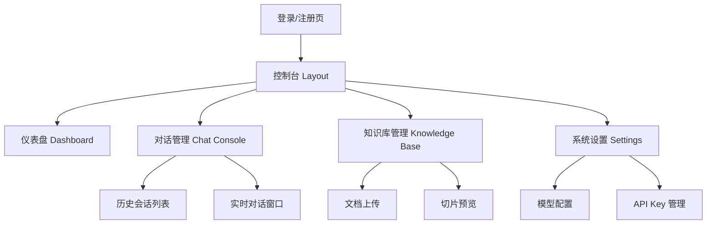
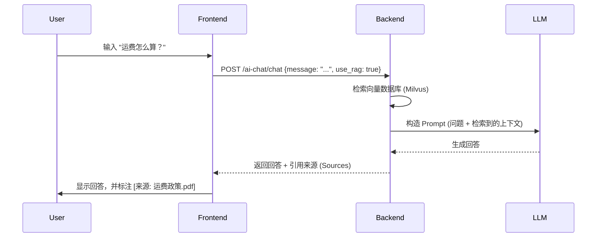

# 电商智能客服 SaaS 平台 - 前端原型设计方案

本文档基于后端 API (http://127.0.0.1:8000/docs) 设计，旨在指导前端页面的开发。

## 1. 站点地图 (Sitemap)



## 2. 页面详细设计

### 2.1 全局布局 (Layout)

- **侧边栏 (Sidebar)**:
  - Logo + 租户名称
  - 导航菜单:
    - 📊 仪表盘 (/dashboard)
    - 💬 对话管理 (/chat)
    - 📚 知识库 (/knowledge)
    - ⚙️ 设置 (/settings)
  - 底部: 用户头像 + 退出登录

- **顶部栏 (Header)**:
  - 面包屑导航
  - 全局搜索
  - 通知中心
  - 当前 API Key 状态 (配额显示)

---

### 2.2 仪表盘 (Dashboard)

**对应 API**: `/api/v1/statistics/*`, `/api/v1/analytics/*`

**布局示意:**

```text
+-------------------------------------------------------+
| [今日对话数: 1,203]  [活跃用户: 450]  [Token消耗: 50k] |
+-------------------------------------------------------+
|                                                       |
|  [对话量趋势图 (折线图)]           [热门意图 (饼图)]    |
|  (近7天数据)                      (售前/售后/投诉)      |
|                                                       |
+-------------------------------------------------------+
|                                                       |
|  [最近的对话列表 (Table)]                              |
|  ID | 用户 | 时间 | 状态 | 操作                       |
|  ...                                                  |
+-------------------------------------------------------+
```

### 2.3 对话管理 (Chat Console) - **核心功能**

**对应 API**: `/api/v1/conversation/*`, `/api/v1/ai-chat/*`

**布局示意:**

```text
+----------------+--------------------------------------+----------------------+
| 会话列表       | 当前对话窗口 (Chat Window)           | 辅助信息面板         |
| (Search)       |                                      |                      |
|                | [User] 我想退货                      | [用户信息]           |
| [User A] 10:00 |                                      | ID: 12345            |
| 🔴 待人工处理   | [AI] 好的，请提供订单号...           | 订单数: 5            |
|                |                                      |                      |
| [User B] 09:45 | [User] 订单号是 20240101             | [RAG 检索结果]       |
| 🟢 AI 处理中    |                                      | 1. 退货政策 (89%)    |
|                | [AI] 查询到订单，正在为您处理...     | 2. 运费说明 (75%)    |
|                |                                      |                      |
|                | ------------------------------------ | [快捷回复]           |
|                | [ 输入框... (支持 / 快捷指令)      ] | - 欢迎语             |
|                | [ 发送 ] [ 转人工 ]                  | - 结束语             |
+----------------+--------------------------------------+----------------------+
```

**交互说明:**
1.  **左侧列表**: 实时刷新，显示用户最新消息。
2.  **中间窗口**:
    - 渲染 Markdown 格式消息。
    - 显示 "Thinking..." 状态 (对应流式 API)。
    - 支持 "转人工" 按钮，暂停 AI 自动回复。
3.  **右侧面板**:
    - 显示 RAG 检索到的知识库片段 (Source Documents)，方便人工客服确认 AI 回答依据。

### 2.4 知识库管理 (Knowledge Base)

**对应 API**: `/api/v1/knowledge/*`

**功能模块:**

1.  **上传文档**:
    - 支持拖拽上传 (PDF/TXT/MD)。
    - 设置切片参数 (Chunk Size, Overlap)。
2.  **文档列表**:
    - 状态列: 处理中 / 完成 / 失败。
    - 操作: 启用/禁用, 删除, 查看切片。
3.  **切片检索测试**:
    - 输入问题，实时测试检索效果 (Hit Rate, Similarity Score)。

### 2.5 系统设置 (Settings)

**对应 API**: `/api/v1/tenant/*`, `/api/v1/model-config/*`

- **模型配置**:
  - LLM Provider: OpenAI / Claude / DeepSeek / 智谱
  - API Key 输入框 (加密存储)
  - Temperature 滑块
  - System Prompt 编辑器

- **API Key 管理**:
  - 生成新的 API Key (用于客户端接入)
  - 查看 Key 使用量

## 3. 关键交互流程

### 3.1 知识库问答流程



### 3.2 人工接管流程

1.  用户在前端点击 "转人工" 或 AI 识别意图为 "人工服务"。
2.  后端更新会话状态 `status = 'human_needed'`。
3.  客服控制台收到 WebSocket 通知，会话高亮显示。
4.  客服在输入框输入回复，后端暂停 AI 自动回复该会话。
